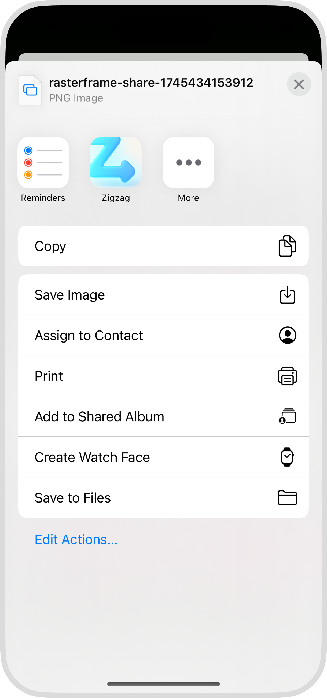

 
 
 
 

 
<strong><em>Zigzag</em></strong>

 
 
 
 

Share an image through <em>Zigzag</em> to your social media for an effortlessly beautiful post or story.

 

<a href="#"><strong>Download on the App Store</strong></a>

 
 
 
 

__What it does and how__

 

_Zigzag_ makes it effortless to share beautiful social media posts and stories.

When you're ready to share an image, whether it's from a text, website or Photos, you share it to _Zigzag_.

Tap on a style you love and it's shared to your social media. It's that quick and easy.

 

<table align="center" width="100%">
  <tr>
    <td align="center" width="33%">
      
    </td>
    <td align="center" width="33%">
      
    </td>
    <td align="center" width="33%">
      
    </td>
  </tr>
  <tr>
    <td align="center" width="33%">
      
Share to <em>Zigzag</em>

    </td>
    <td align="center" width="33%">
      
Tap a style

    </td>
    <td align="center" width="33%">
      
Post on social media

    </td>
  </tr>
</table>

 
 

__Privacy__

 

> What data does _Zigzag_ collect?

Data is never collected by _Zigzag_.

 

> Is it safe to share any photo to _Zigzag_?

Yes, any photo shared to _Zigzag_ is deleted when you leave the app and never sent anywhere else.

 
 

__Support__

 

If you have any questions or need support, please email <a href="mailto:zigzag@hejthor.com">zigzag@hejthor.com</a>.

 
 
 
 

---

 
 

<em>Zigzag</em> is a product of HEJ THOR

 

 
 